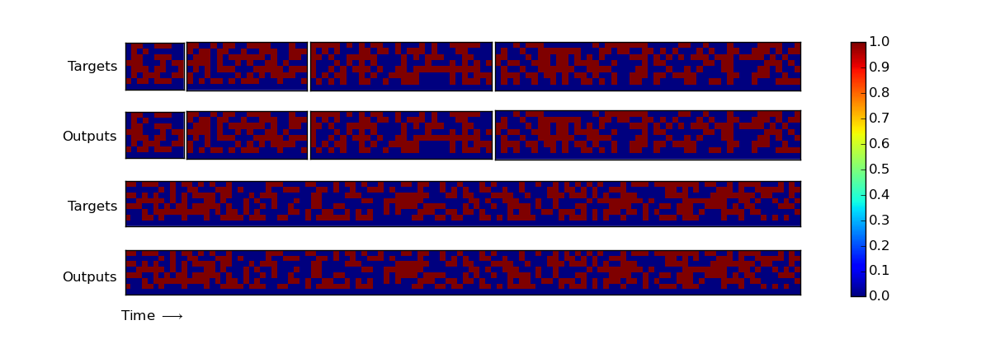

# Neural Turing Machines

An attempt at replicating ["Neural Turing Machines"](http://arxiv.org/abs/1410.5401) (by Alex Graves, Greg Wayne, and Ivo Danihelka) in Keras.


## Prerequisties
- Python 2.7
- [Theano](https://github.com/Theano/Theano)
- [Keras](https://github.com/fchollet/keras)


## Results
**Copy**



**Repeat Copy**
(in progress)

**Associative Recall**
(in progress)

**Dynamic N-Grams**
(in progress)

**Priority Sort**
(in progress)


## Usage
To train a copy task:
```
    $ python main.py
```


## Other NTM Implementations
- carpedm20/NTM-tensorflow. Check out: https://github.com/carpedm20/NTM-tensorflow
- shawntan/neural-turing-machines. Check out: https://github.com/shawntan/neural-turing-machines
- snipsco/ntm-lasagne. Check out: https://github.com/snipsco/ntm-lasagne 


## Future works
- Training NTM to learning *repeat copy*.
- Training NTM to learning *associative recall*.
- Training NTM to learning *dynamical n-grams*.
- Training NTM to learning *priority sort*.
- Using NTM for other natural language processing tasks such as neural language model.


## Author
Zhibin Quan / [@SigmaQuan](https://github.com/SigmaQuan)