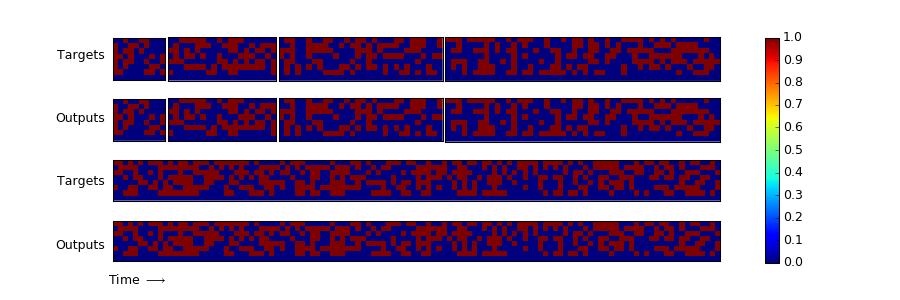

# Neural Turing Machines

An attempt at replicating ["Neural Turing Machines"](http://arxiv.org/abs/1410.5401) (by Alex Graves, Greg Wayne, and Ivo Danihelka) in Keras.


## Prerequisites
- Python 2.7
- [Numpy 1.12.0](https://pypi.python.org/pypi/numpy)
- [Scipy 0.18.1](https://pypi.python.org/pypi/scipy/)
- [Theano 0.8.2](http://deeplearning.net/software/theano/)
- [Keras 1.2.0](https://github.com/fchollet/keras)
- [CUDA 8.0](https://developer.nvidia.com/cuda-downloads)
- [cuDNN 5.0](https://developer.nvidia.com/cudnn)
- [Matplotlib 1.5.3](http://matplotlib.org/1.5.3/index.html)


## Results
### Algorithms Learning
**Repeat Copy**

**NTM Memory Use During the Copy Task**


**Associative Recall**
(in progress)

**Priority Sort**
(in progress)


## Usage
To train a repeat copy task with LSTM:
```
    $ python learning_repeat_copy_lstm.py
```

To train a associative recall task with LSTM:
```
    $ python learning_associative_recall_lstm.py
```

To train a priority sort task with LSTM:
```
    $ python learning_priority_sort_lstm.py
```

To train three different tasks one by one with LSTM:
```
    $ python learning_algorithm_lstm.py
```

## Other NTM Implementations
- carpedm20/NTM-tensorflow. Check out: https://github.com/carpedm20/NTM-tensorflow
- shawntan/neural-turing-machines. Check out: https://github.com/shawntan/neural-turing-machines
- snipsco/ntm-lasagne. Check out: https://github.com/snipsco/ntm-lasagne 


## Future works
- Training NTM to learning *repeat copy*.
- Training NTM to learning *associative recall*.
- Training NTM to learning *dynamical n-grams*.
- Training NTM to learning *priority sort*.
- Using NTM for other natural language processing tasks such as neural language model.


## Author
Zhibin Quan / [@SigmaQuan](https://github.com/SigmaQuan)